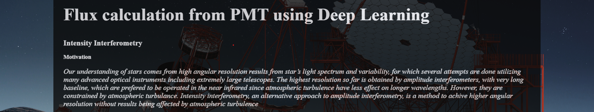
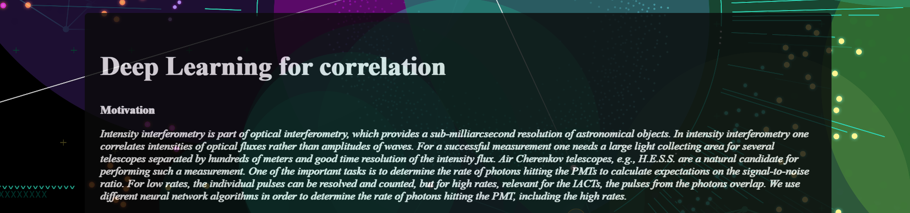
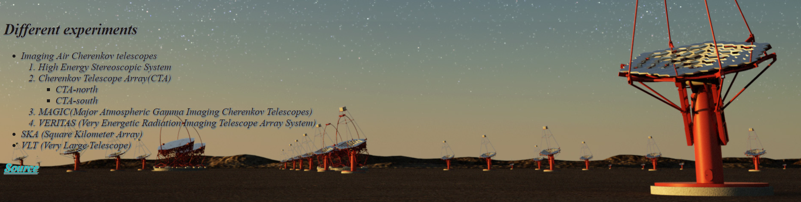
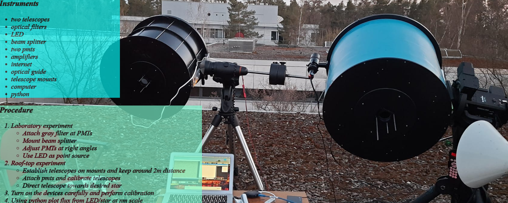
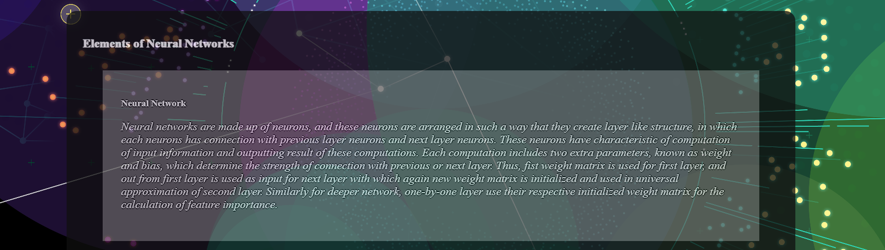
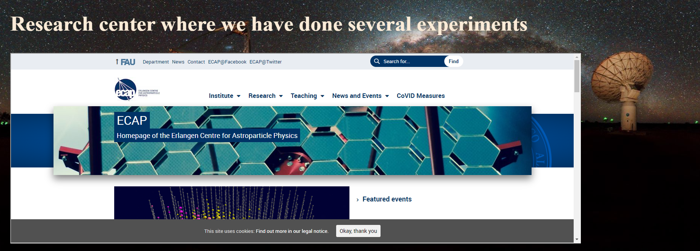
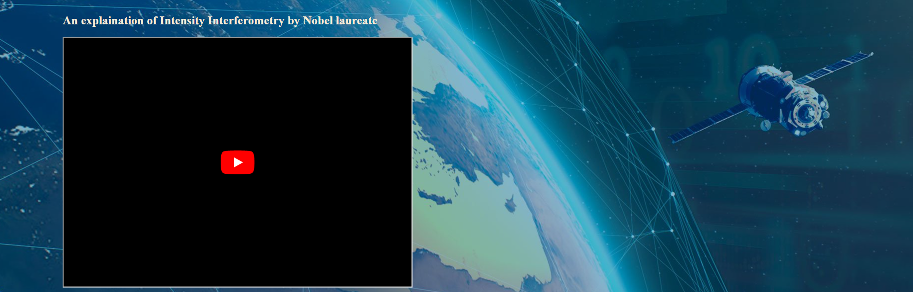
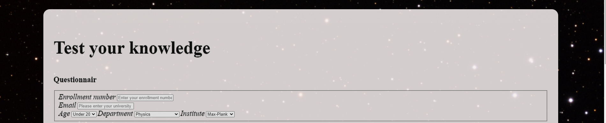
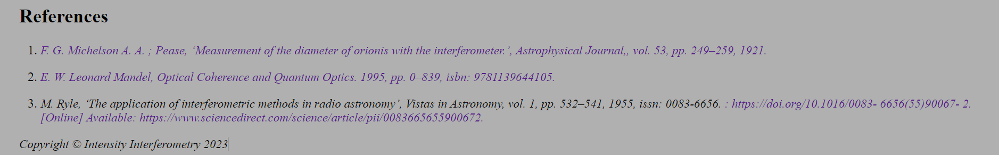

# Intensity Interferometry web applicaiton

This web application development project is a part of the course requirement of full-stack deelopment. The project is aimed to provide information about research done in a specific field in detail. It includes conceptual __introduction__ and __motivation__ behind the project.

The project delivers additional informnation such as __historical development__ in intensity interferometry and _general information about neural networks_. Further, user can also get to know about different type of experiments(telescopes) actively used for research in interferometry, and __instruments__ and __procedure__ for intensity interferometry.
In the first page website of Erlangen Center for Astorparticlephysics is embedded, where I have performed experiments. ON the second page the link to a lecture by Prof. Alain Aspekt on Hanbury-Brown-Twiss intensity interferometry is embedded.

| Intensity Interferometry | Neural Networks |
| --- | --- |
|  |  |
|<table><tr><td></td>  <td></td></tr></table> |  |
|  |  |

On the second page elements of artificial neural networks are presented. An explanation of the optimizer, loss function, and neural network is also provided. Further, different neural network types are also explained.
- Fully connected Neural Network (FCNN)
- Convolutional Neural Network (CNN)
- Long-Short Term Memory (LSTM)

ON the third page __Questaionair__ is created for students to answer, which are directly submitted to the record of specific students.
This form includes some compulsory fields. It also allows students to mention their connection with specific university, department, research center and field of study. At the end of the form students are asked to enter their feedback regarding examination.

In the last section information about web applicaiton creator is mentioned and asked is user has some query related to provided topics. In the footer, all the information references are mentioned.

## Referred Sources
1. Flux calculation from PMT using deep learning
2. Full-stack development by Code Institute
3. Cherenkov Telescope Array(CTA)
4. https://www.codinglabweb.com/2021/04/contact-us-form-in-html-and-css-free.html
5. https://www.w3schools.com/tags/att_select_required.asp
6. https://developer.mozilla.org/en-US/docs/Web/HTML/Element/article
7. https://www.youtube.com/watch?v=5Uz33vo4GoQ&ab_channel=DevLangford

